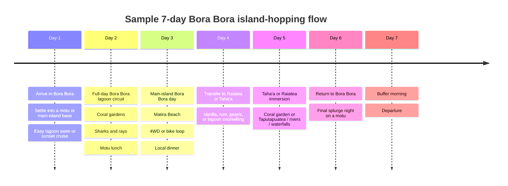

# Island Hopping in Bora Bora

## Executive summary

Island hopping in Bora Bora is **common and straightforward inside the Bora Bora lagoon**, where the “hops” are usually boat-based movements between the main island and nearby motu for snorkelling, motu lunches, coral gardens, beach time, and sunset cruises. It is **also viable at a wider regional scale**—especially to neighbouring Taha’a and Raiatea—but that second meaning of island hopping is more logistically demanding, usually more expensive, and much less spontaneous. Official destination guidance from entity["organization","Tahiti Tourisme","french polynesia tourism"] actively recommends boat trips to Bora Bora’s motu and also sells Bora Bora–Taha’a combinations; entity["company","Air Tahiti","interisland airline"] sells dedicated Leeward-islands multi-island passes that explicitly bundle Bora Bora with Raiatea and other nearby islands. citeturn21view2turn41view1turn12view2turn41view1

Analytically, the best way to think about the question is to separate **three layers of travel**. First, the **main island of Bora Bora** gives you roads, local restaurants, public beach access and easier self-guided movement. Second, the **motu resorts** give you the canonical overwater-villa experience, maximum privacy, reef access and best Mount Otemanu views, but at the cost of dependence on resort boats and fixed transfer windows. Third, the neighbouring pair of entity["place","Taha'a","society islands"] and entity["place","Raiatea","society islands"] add the cultural and “beyond-the-postcard” layer: vanilla plantations, rum distilleries, pearl farms, a UNESCO World Heritage marae, rivers, waterfalls and a more local rhythm of life. citeturn41view0turn28view0turn28view3turn9view0turn9view3turn10view0turn21view3turn20search5turn20search8

The strongest planning conclusion is this: for **3–4 nights**, stay in one Bora Bora base and day-hop; for **5–7 nights**, either split Bora Bora between a motu resort and the main island, or add **one** neighbouring-island segment; for **8+ nights**, a true Bora Bora + Taha’a/Raiatea split begins to make more sense. That conclusion is an inference from the way official itineraries and specialist operators structure the destination: Tahiti Tourisme proposes standalone four-day Bora Bora and four-day Taha’a itineraries, while Audley’s multi-island routing gives both Taha’a and Bora Bora four nights each. citeturn21view2turn21view3turn39view2

**Assumptions used where needed in this report:** unless otherwise noted, sample budgets assume **2 adults**, a **6-night / 7-day trip**, **international airfare excluded**, and **economy / shared transport** except in the luxury scenario. Where XPF amounts are converted into USD, I use an exchange reference of roughly **USD 1 = XPF 101.9–102.2** as of 4 May 2026. citeturn42search0turn42search5

## Viability and geography

The evidence points to a **two-tier verdict**. Inside Bora Bora itself, island hopping is not only viable but arguably one of the destination’s default experiences: Tahiti Tourisme’s suggested Bora Bora itinerary opens with a boat circuit to the motu, and its destination guide repeatedly pushes lagoon tours, private motu lunches, coral gardens, catamaran outings and neighbouring-island cruises. TripAdvisor’s excursion ecosystem overwhelmingly reflects the same pattern, with Bora Bora’s highest-volume tours clustered around half-day and full-day lagoon circuits rather than terrestrial sightseeing. citeturn21view2turn41view1turn14view0turn14view3

At the regional level, Bora Bora–Taha’a–Raiatea island hopping is clearly **possible**, but it is better understood as a short multi-island journey than as casual local hopping. Air Tahiti’s current pass structure explicitly packages Bora Bora and Raiatea with other Leeward islands, and Tahiti Tourisme says there are regular flights and ferries between Raiatea, Huahine and Bora Bora. Taha’a has no airport of its own; it is reached via Raiatea airport plus boat transfer, or by limited premium options such as helicopter transfers. That extra layer of plane/boat coordination is what makes wider island hopping viable, but not frictionless. citeturn12view2turn21view1turn10view1turn33search6

The practical differences between the main island, the Bora Bora motu, and the neighbouring islands are summarised below.

| Base | Landscape and feel | Typical lodging examples | Best for | Accessibility and trade-offs | Sources |
|---|---|---|---|---|---|
| **Bora Bora main island** | Volcanic interior, road access, town services, easier access to restaurants and the public strand at entity["point_of_interest","Matira Beach","bora bora"]. | entity["hotel","Le Maitai Polynesia Bora Bora","bora bora, french polynesia"], Hôtel Matira. | Travellers who want flexibility, lower transfer friction, beach time, and easier DIY exploration by bike, scooter or car. | Airport arrivals can take the included Air Tahiti shuttle to Vaitape; road transport and rentals are straightforward. Trade-off: less of the ultra-private “private-islet” feel than the outer motu resorts. citeturn21view0turn41view0turn28view0turn28view3 |
| **Bora Bora motu** | Palm-covered islets on the lagoon edge; strongest postcard views; direct access to reef and lagoon; higher privacy. | entity["hotel","Le Bora Bora by Pearl Resorts","bora bora, french polynesia"], overwater-villa resorts such as the major motu properties. | Honeymoons, privacy, direct-from-villa snorkelling, overwater stays, best Mount Otemanu framing. | Boat dependence is the key trade-off. Bora Bora resorts on motu rely on hotel boats, fixed schedules and, in some cases, extra charges for non-standard or town transfers. citeturn41view1turn10view0turn9view0turn9view3 |
| **Taha’a** | Slower, greener, more fragrant and more rural; known for vanilla, rum, pearl farms, coral garden and motu. | entity["hotel","Le Taha'a by Pearl Resorts","tahaa, french polynesia"] and smaller island properties. | Travellers who want a softer, more cultural and less tourist-saturated companion to Bora Bora. | Reachable via Raiatea airport plus boat, or by scheduled ferry links through the Leeward network; adds one more transfer layer but reward is authenticity and calmer pacing. citeturn21view3turn20search4turn10view1turn25search8 |
| **Raiatea** | More working island than fantasy-islet; cultural heartland with waterfalls, hikes, Faaroa River and the UNESCO-listed Taputapuatea complex. | Raiatea guesthouses and small hotels such as Raiatea Lodge Hotel or Vai Ute Ute Lodge. | Travellers who want history, hiking, river/waterfall outings, local town life and easier inter-island transport. | Tahiti Tourisme notes regular flights and ferries linking Raiatea with Bora Bora and the rest of the Leewards; roads, buses and taxis make it the easiest neighbouring base for movement. citeturn20search5turn20search8turn21view1turn21view4turn31view2 |

The key strategic distinction is that **Bora Bora sells scenery and resort theatre**, whereas Taha’a and Raiatea add **variation**. Tahiti Tourisme frames Taha’a around vanilla, rum, pearls, motu and coral-garden snorkelling, and frames Raiatea around history, hiking, river access, wreck diving and the Taputapuatea marae. Audley makes a similar distinction, describing Taha’a as less visited and less populated than Raiatea, and routing travellers through Raiatea airport into a Taha’a motu stay before returning to Bora Bora. citeturn21view3turn20search5turn20search8turn38view5turn39view0

## What TripAdvisor and other travel sources indicate

TripAdvisor’s current excursion landscape strongly suggests that **the market’s mainstream version of “island hopping” in Bora Bora is lagoon hopping**, not hotel-to-hotel movement. The biggest reviewed products are shared or small-group lagoon/snorkelling trips, followed by a smaller but still visible premium niche for neighbour-island hops to Taha’a. The more ambitious Bora Bora-to-Taha’a products exist, but they are either very expensive or have much thinner review volume than the classic Bora Bora lagoon circuit. citeturn14view0turn14view3turn18search1turn18search2

| TripAdvisor product | What it represents | Rating / review volume | Indicative price | What travellers highlight or what the listing implies | Sources |
|---|---|---:|---:|---|---|
| **Full Day Lagoon Group Tour in Bora Bora with Lunch** | The archetypal Bora Bora “motu + lagoon” hop. | **5.0 / 944 reviews** | **US$179.81 pp** | High-volume, classic full-day Bora Bora experience. Detailed review text praises guides, marine life and motu lunch. citeturn6search16turn13view1 | citeturn6search16turn13view1 |
| **Reef Discovery Half Day Group Signature Tour** | Shorter lagoon sampler. | **5.0 / 857–874 reviews** | **US$136.51–137.67 pp** | One of the strongest volume signals that half-day reef hopping is a core Bora Bora product. citeturn14view0turn14view3 | citeturn14view0turn14view3 |
| **Half day Snorkeling Shared Boat Tour in Bora Bora** | Entry-level shared-lagoon hop. | **5.0 / 538–550 reviews** | **US$130 pp** | Good proxy for the lower-cost end of Bora Bora’s day-hopping market. citeturn14view0turn14view5 | citeturn14view0turn14view5 |
| **Explore the Vanilla Island Full-Day Tour to Taha’a from Bora Bora** | Genuine neighbouring-island hop from Bora Bora. | **5.0 / 4 reviews** | **US$697.10 pp** | Viable, but the tiny review base means the rating is not yet robust; price is dramatically above Bora Bora-only boat days. citeturn18search1 | citeturn18search1 |
| **Taha’a Day Trip from Bora Bora by Seaplane** | Fast premium regional hop. | **4.7 / 43 operator reviews** | Premium; listing signals a seaplane format rather than a budget transfer. | Strong niche appeal for those buying time savings and aerial drama, not value. citeturn18search2 | citeturn18search2 |
| **The Vanilla tour of Taha’a in a comfortable outrigger canoe** | Best fit once you are already in Raiatea/Taha’a. | **5.0 / 41 reviews** | **US$151.38 pp** | Shows the value gap between taking the Taha’a tour locally and importing it from Bora Bora as a day trip. citeturn15search2 | citeturn15search2 |

TripAdvisor review text is remarkably consistent about **what people love** on Bora Bora day-hops: personal guides, wildlife density, cultural narration, music on the boat, and lunches on a motu. The more useful complaints are equally consistent. Weather matters; it can force route changes. Some operators are described as using semi-private rather than truly private motu setups. One detailed review also flags concern that wildlife encounters may involve food-conditioned rays and fish, which will matter to travellers who want strictly natural encounters. citeturn13view1turn13view3

Beyond TripAdvisor, the broader travel ecosystem points in the same direction but adds an important qualification. entity["organization","Lonely Planet","travel publisher"] treats Bora Bora as a year-round destination but says May to October is the peak dry season with higher prices and tighter availability, while shoulder months such as April/May and September/October can be attractive for fewer crowds and softer weather trade-offs. entity["organization","Conde Nast Traveler","travel magazine"] has long argued that travellers learn more about French Polynesia by moving between islands rather than remaining confined to one resort, because resort-only stays can be limiting and inter-island flights add cost and time; its more recent adventure coverage explicitly pushes Bora Bora and Raiatea as part of a broader multi-island trip. entity["organization","Audley Travel","travel specialist"] operationalises that idea in a concrete routing: Air Tahiti to Raiatea, launch to Taha’a, then back to Raiatea airport and onward to Bora Bora, with four nights in Taha’a and four in Bora Bora. citeturn38view1turn23search14turn19search6turn38view4turn39view0turn39view2

The main analytical takeaway from those outside sources is that island hopping is usually about **buying contrast**. Bora Bora gives the ultimate lagoon-and-luxury payoff; Taha’a gives vanilla, coral garden and slow island life; Raiatea gives heritage, rivers, waterfalls and a more grounded Polynesian experience. That is why Tahiti Tourisme’s own suggested Taha’a itinerary explicitly tells visitors not to skip a detour to Raiatea to see Taputapuatea, and why specialist itineraries often give Bora Bora and Taha’a roughly equal time rather than treating one as a quick add-on. citeturn21view3turn39view0turn39view2

## Lodging strategy and transfer logistics

For most travellers, the core lodging decision is **one resort vs multiple bases**. Staying in one resort is the cleanest option if your trip is short, if your priority is uninterrupted relaxation, or if you are booking a high-end resort whose room, service and views are the trip. That strategy also aligns with how major resorts price themselves: Four Seasons currently promotes a **fourth night free** offer, and Marriott’s St. Regis Bora Bora offers include packages triggered by **four-night minimum stays**. In other words, the hotel economics often reward staying put. citeturn37search1turn37search4

Multiple resorts or multiple islands make more sense when your goal is not simply luxury, but **variation**. The most compelling examples are either **main-island Bora Bora + motu Bora Bora** or **Bora Bora + Taha’a/Raiatea**. This approach is even directly incentivised by some operators: Pearl Resorts currently advertises a “Pearl Horizons” offer giving **35% off** when at least two Pearl properties are combined, including Bora Bora and Taha’a. That is a rare case in which island hopping can improve, rather than worsen, room economics. citeturn37search2turn37search10

For travellers specifically considering entity["hotel","Four Seasons Resort Bora Bora","bora bora, french polynesia"] and/or entity["hotel","The St. Regis Bora Bora Resort","bora bora, french polynesia"], the logistics differ in ways that matter.

| Resort or property type | Airport access | Main-island access | Operational implications for island hopping | Sources |
|---|---|---|---|---|
| **Four Seasons Resort Bora Bora** | Officially a **15-minute boat ride** from Bora Bora airport. | Official site says it can arrange fixed-schedule connections with Vaitape Harbour; one official page describes a **25-minute** service, another its day shuttle as **30 minutes each way**, with advance reservation required and capacity limited. | Excellent if you want a self-contained motu base, but day trips into town or coordination with another hotel require planning around fixed times. The resort also promotes private yachts and a helipad for premium transfers. citeturn9view0turn9view2turn26search0turn26search12 | citeturn9view0turn9view2turn26search0turn26search12 |
| **The St. Regis Bora Bora Resort** | Officially a **20-minute boat ride** from airport; shared airport transfer is priced at **XPF 8,600 one-way** or **XPF 17,200 round trip** per person. | Located on a motu; official site says boats are necessary to reach the main island. One complimentary daily shuttle runs Monday–Saturday, with additional shuttles charged at **XPF 3,600 round trip** per person; reservations are mandatory. | Better than many motu resorts if you want occasional town access, because the official main-island shuttle regime is more transparent. Still, it is a schedule-based system rather than free-flow mobility. citeturn9view3 | citeturn9view3 |
| **Le Taha’a by Pearl Resorts** | No airport on Taha’a itself; official routing is via Raiatea airport and then a **35-minute boat** transfer to the resort. Shared boat is **XPF 7,100 one-way** per adult; private boat on request at extra cost. | The resort is on Motu Tautau and its public materials also mention a shuttle to the village and a **14-minute helicopter** option from Bora Bora. | Beautiful for a second-island stay, but it necessarily adds one more plane/boat hand-off than a Bora Bora-only trip. Send flight details in advance. citeturn10view1turn33search6 | citeturn10view1turn33search6 |
| **Bora Bora main-island hotels** | Bora Bora airport arrivals can use the Air Tahiti shuttle to Vaitape, included in airfare. | Easy road access once on the island; no resort-boat dependence. | Best for flexible restaurant-hopping, grocery runs, car/bike rental and lower-friction transfer days. citeturn21view0turn28view0turn28view3 | citeturn21view0turn28view0turn28view3 |

If you want to **split St. Regis and Four Seasons on the same Bora Bora stay**, the trip is feasible, but the benefit is mostly comparative—different views, room styles and service cultures—not cultural variety. The hidden cost is that each resort sits on its own transfer system. In practice, the smoothest version is a concierge-to-concierge handoff or a private transfer; the less elegant version is working around shared resort boats and Vaitape connections. Traveller reports on TripAdvisor repeatedly complain that fixed shuttle timings and extra transfer charges can make motu-to-town or hotel-to-hotel movements feel more restrictive than expected. Those reports are anecdotal rather than official policy, but they line up with what the resort sites themselves already show: capacity limits, fixed schedules and paid extras once you move outside the standard airport run. citeturn9view2turn9view3turn36search2turn26search14

My planning judgement is therefore straightforward. If you want the **St. Regis / Four Seasons experience**, choose **one** of them and keep the rest of your hopping external—town lunches, lagoon tours, or a second island. If you want a **true two-centre itinerary**, Bora Bora + Taha’a/Raiatea gives much more return on the extra logistics than St. Regis + Four Seasons alone. That conclusion is an inference from the official transport structures and the far stronger experiential contrast described by Tahiti Tourisme, Audley and Condé Nast. citeturn9view0turn9view3turn21view3turn39view0turn19search6

## Costs and sample budgets

The cost structure of island hopping around Bora Bora is dominated by **three levers**: transport mode, room class, and whether you hop locally inside Bora Bora or regionally to Taha’a/Raiatea. Local day-hopping is comparatively affordable: shared Bora Bora lagoon/snorkelling products cluster around **US$130–180 per person**, while terrestrial add-ons such as a half-day 4WD island tour sit below **US$90 per person**. Once you extend to a real neighbouring-island hop, the gap widens sharply. A locally booked Taha’a outrigger day from the Raiatea/Taha’a area sits around **US$151 per person**, but importing that experience from Bora Bora as a same-day excursion jumps to roughly **US$697 per person**. citeturn14view2turn14view5turn18search1turn15search2

Transport costs tell the same story. In the Leeward ferry network, Apetahi Express lists **XPF 6,000 one-way** for Raromatai-to-Raromatai travel and describes Bora Bora–Taha’a as a one-hour sector inside its route chain. For air, current OTA snapshots on the Bora Bora–Raiatea route suggest one-way fares starting around **US$84–97** and round trips from about **US$168** per person, while Air Tahiti’s official multi-island passes start at **€396.21** for Tahiti plus two Leeward destinations. Resort transfers add another layer: St. Regis officially charges **XPF 17,200 round trip per person** for airport transport, while Le Taha’a officially charges **XPF 14,200 round trip per person**. citeturn25search0turn25search8turn24search0turn24search8turn12view2turn9view3turn10view1

Room class is where the total budget changes most radically. TripAdvisor’s current average-rate bands put Maitai Polynesia Bora Bora at roughly **US$260–1,070** per standard room night, Four Seasons Bora Bora at roughly **US$1,914–3,255**, St. Regis Bora Bora at roughly **US$1,272–3,113**, and Le Taha’a at roughly **US$1,359–2,723**. That is why Bora Bora island hopping can be either a manageable extension or a five-figure luxury project, depending on how much of the trip is spent in motu resorts. citeturn34search0turn34search1turn34search2turn34search3

### Indicative line-item costs

| Cost item | Current indicative price | Analytical use | Sources |
|---|---:|---|---|
| Shared Bora Bora lagoon / snorkel half-day | **US$130 pp** | Best-value local hop. | citeturn14view0turn14view5 |
| Shared Bora Bora reef / lagoon half-day | **US$136.51–137.67 pp** | Premium but still mainstream local hop. | citeturn14view0turn14view3 |
| Full-day Bora Bora lagoon group tour with lunch | **US$179.81 pp** | Standard full-day motu/lagoon hopping benchmark. | citeturn6search16 |
| Bora Bora half-day 4WD island tour | **US$88.01–102.39 pp** | Cheapest way to add inland/cultural contrast without changing islands. | citeturn14view2turn14view5 |
| Taha’a full-day tour booked locally | **US$151.38 pp** | Shows the value of sleeping in the Raiatea/Taha’a area before touring. | citeturn15search2 |
| Taha’a full-day tour imported from Bora Bora | **US$697.10 pp** | High-cost same-day neighbouring-island hop. | citeturn18search1 |
| Apetahi ferry, Leeward-islands segment | **XPF 6,000 one-way pp** | Cheapest scheduled inter-island movement if your timing matches. | citeturn25search0turn25search8 |
| Bora Bora–Raiatea airfare snapshot | **US$84–97 one-way**, **from US$168 round trip** | Typical economy benchmark for fast inter-island movement. | citeturn24search0turn24search8turn24search10 |
| St. Regis airport transfer | **XPF 8,600 one-way pp / XPF 17,200 round trip pp** | Important hidden cost in luxury split stays. | citeturn9view3 |
| St. Regis extra Vaitape shuttle | **XPF 3,600 round trip pp** | Cost of leaving the resort outside the complimentary pattern. | citeturn9view3 |
| Le Taha’a airport boat | **XPF 7,100 one-way pp** | Mandatory transfer cost for a Taha’a luxury stay. | citeturn10view1 |

### Sample budgets for two adults

The table below uses a **6-night / 7-day** frame and excludes international airfare, most lunches/dinners, and discretionary spa / drinking spend. Where a hotel source only provides a range, the medium and high scenarios use the **midpoint of the current rate band as a budgeting proxy**. XPF items are converted at about **US$1 = XPF 101.9–102.2**. citeturn42search0turn42search5

| Style | Representative structure | What is included in the estimate | Indicative total for 2 adults | Sources |
|---|---|---|---:|---|
| **Low** | Stay on Bora Bora only, on the main island or a budget property; hop by day boat to motu rather than by air to another island. | 6 nights from Bora Bora’s lower hotel floor (**from US$183/night**), 1 full-day lagoon tour, 1 half-day 4WD tour. | **~US$1,634**; add another half-day snorkel and it rises to about **US$1,894**. | citeturn34search8turn6search16turn14view2turn14view5 |
| **Medium** | 4 nights Bora Bora at a 3-star type base, plus 2 nights on Raiatea; local touring on both sides. | 4 nights using the midpoint of Maitai’s current price band, 2 nights at Vai Ute Ute Lodge (**XPF 20,000/night for 2**), Bora Bora–Raiatea return flights from the current low OTA band, 1 Bora Bora shared snorkel day, 1 local Taha’a day tour. | **~US$4,000**. | citeturn34search2turn31view2turn24search0turn14view5turn15search2 |
| **High** | Split luxury motu resorts across islands. | 3 nights St. Regis using the midpoint of its current rate band, 3 nights Le Taha’a using the midpoint of its current rate band, St. Regis and Le Taha’a published transfer fees, Bora Bora–Raiatea return flights, and 1 Bora Bora lagoon day. | **~US$14,000** before high-end dining, private transfers or helicopter add-ons. For comparison, Tahiti Tourisme’s current Bora Bora–Taha’a packages start around **US$4,369–5,399 pp** for Pearl Resorts and **US$7,899–9,499 pp** for a St. Regis-led two-island luxury itinerary. | citeturn34search1turn34search3turn9view3turn10view1turn24search0turn6search16turn27search14turn29search0 |

The main cost lesson is simple: **the expensive part is not the idea of hopping, but the class of hopping**. If you stay on Bora Bora and make the lagoon your playground, the premium is modest. If you add Raiatea/Taha’a with regular flights or ferries and modest lodging, the trip remains manageable. If you layer neighbouring islands on top of Bora Bora’s flagship motu resorts, every transfer day becomes a luxury event in itself. citeturn25search0turn24search0turn34search0turn34search1turn34search3

## Sample itinerary and practical tips

A good 5–7 day island-hopping plan should preserve two things at once: **enough Bora Bora lagoon time** to justify being there, and **enough time off Bora Bora** to justify the extra transfer. Official and specialist itineraries support that logic: Tahiti Tourisme treats Bora Bora and Taha’a as destinations with several days of content each, while Audley’s longer routing gives each a four-night block. For a one-week trip, the most balanced compromise is therefore a **Bora Bora anchor with one neighbouring-island block**. citeturn21view2turn21view3turn39view2

A practical day-by-day version of that plan is as follows. **Day 1–2:** arrive in Bora Bora, use the first full day for the classic lagoon circuit and motu lunch, because this is still the destination’s core experience. **Day 3:** move across Bora Bora’s own internal contrast—town, viewpoints, WWII remains, Matira, local restaurants. **Day 4–5:** transfer to Taha’a or Raiatea. Choose Taha’a if you want coral garden, perfume, motu and overwater calm; choose Raiatea if you want Taputapuatea, Faaroa River, waterfalls and easier surface transport. **Day 6:** return to Bora Bora for a final overwater or sunset-oriented night. **Day 7:** depart with a buffer morning rather than a tight same-day sequence of hotel boat + airport boat + flight. That is an inference from the fixed-transfer structures published by the resorts. citeturn41view1turn21view2turn41view0turn21view3turn20search5turn9view2turn9view3turn10view1

The **best time** for this style of trip is usually the **dry season from May to October**, when Tahiti Tourisme says weather is sunnier and less humid, and Lonely Planet notes better snorkelling visibility but also higher prices and tighter resort availability. A particularly smart compromise is often **April/May or September/October**, which gives you a better chance of pleasant weather without the full crowd-and-price pressure of peak dry-season weeks. citeturn23search0turn38view1turn23search14

The most important **booking advice** is to work backwards from transfer constraints, not just from room availability. Four Seasons says its Vaitape shuttle has limited capacity, fixed times and must be reserved in advance; St. Regis says concierge reservations are mandatory for main-island shuttles; Le Taha’a asks guests to send flight details in advance for its airport boat; and ferry services in the Leewards also run on finite schedules. In practice, that means the flight/ferry and boat layers should be secured **before** you set non-refundable dinners, spa treatments or external excursions on transfer days. citeturn9view2turn9view3turn10view1turn25search5

Packing should follow the destination logic. Because Bora Bora/Taha’a/Raiatea hopping is heavily **boat- and water-dependent**, the most useful packing choice is not formalwear but transfer-friendly gear: swimwear that dries fast, sandals or reef-capable footwear, sun protection, and a dry bag or organised carry-on for boat days. That recommendation is a practical inference from the activity mix and published transport structures rather than a formal rule. citeturn41view1turn21view3turn9view0turn9view3turn10view1

On **visas and permits**, there is no separate “island-hopping permit” within French Polynesia. The legal question is your entry right into the territory in the first place. Tahiti Tourisme directs travellers to France-Visas to check nationality-specific rules, and UK government advice says British travellers can visit French Polynesia for **up to 90 days** for tourism or business without a visa; all visitors should have a valid passport and onward ticket, and Bora Bora resort guidance also reminds travellers that customs clearance happens in Papeete before onward domestic travel. If you plan to drive, GOV.UK notes that UK travellers need the **1968 International Driving Permit** plus a UK licence. citeturn22search2turn22search1turn9view0turn22search17

The final practical recommendation is to preserve **one buffer afternoon** and **one unprogrammed morning** in any Bora Bora island-hopping plan. The reason is not just weather. It is the accumulation of small schedule frictions: airport boats, harbour shuttles, check-in waits, fixed village runs, and the fact that the best experiences—motu lunches, snorkelling, sunset cruises—depend on light and water conditions. In Bora Bora, the best itinerary is rarely the fullest one; it is the one that leaves enough room for the lagoon to dictate the pace. citeturn9view2turn9view3turn39view0turn21view2
map